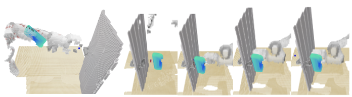

# Action-Centric Vision-and-Language Manipulation Using Perceiver-Actor on VLMbench



Recent progress in embodied AI makes robotics close to reality but it is still an open question how the agent can do manipulation tasks following human guidance. It is essential for robot agents to complete manipulation tasks with language guidance from humans.  By following the language instructions, robots can 1) pay more attention to the target place or objects that humans are concerned about and 2) have more information in scene understanding like inter-object relation. Among all existing algorithms, the state-of-the-art robot-centric Perceiver-Actor works well in multiple housing tasks (e.g. pick, place and stack) in RLBench. This project re-implements Perceiver-Actor, tests the result on the tasks on VLMbench dataset that has not been tested on Perceiver-Actor yet.


To train and test the Perceiver-Actor, there are three steps:

Firstly refer to [VLMbench](https://github.com/eric-ai-lab/vlmbench) for setting up the environment. ***conda*** is recommended.

Secondly download [training and testing dataset](https://drive.google.com/drive/folders/1Qx_2_ePIqf_Z6SnpPkocUiPgFeCfePQh) of VLMbench

Thirdly, change the training and testing data directory in ***./train_peract.py*** and run the command 
```bash
python ./train_peract.py
```
